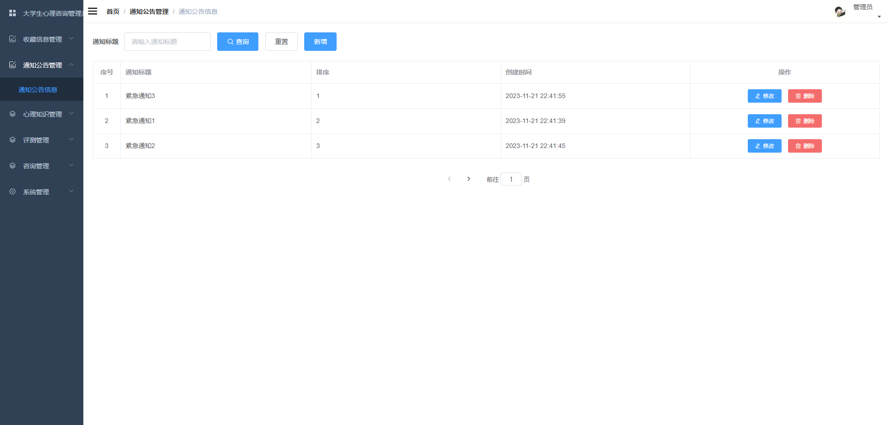

# 基于Java+Springboot+Vue大学生心理咨询小程序-毕业设计

# 获取地址

#### 作者QQ：3275035005 微信：xkbishe123 (支持修改、 部署调试、 代做接毕业设计和课程设计)

#### 网站建设、小程序、H5、APP、各种系统、样式修改、10000套源码可选。

#### 选题+开题报告+任务书+程序定制+安装调试+论文+答辩ppt 都可以做

#### 问题包修改，包满意，有需求尽管甩过来！一条龙帮你安心过！

#### 所有项目以及源代码本人均调试运行无问题 可支持远程调试运行

# 项目介绍
基于基于SpringBoot大学生心理咨询小程序-毕业设计，本系统分微信小程序和管理后台两部分，项目采用前后端分离

可选题目：心理咨询小程序、校园心理咨询小程序、大学生心理咨询小程序、心理咨询平台

### 1. 用户

​	用户登录，用户注册、查看通知、心理评测、查看心理知识、收藏心理知识、查看个人心理健康指数分析、查看咨询师、匿名咨询、在线咨询、评测记录、我的收藏、密码修改、密码修改、个人信息修改、退出登录

###  2. 管理员

管理员登录、首页统计、收藏信息管理、通知公告管理、心理知识管理、评测信息管理、学生画像分析、咨询管理、用户管理、密码修改、个人中心 

### 3. 咨询师端

咨询师登录、首页统计、心理知识管理、评测信息管理、咨询信息管理、咨询在线沟通、密码修改、个人中心 

# 技术框架
- 开发语言：Java 
- 数据库：Mysql 
- 系统环境：jdk8、maven、node
- 后端框架：SpringBoot、MyBatisplus、MyBatis
- 前端框架：Vue、Elementui、微信小程序
- 工具：IDEA、Navicat、微信开发者工具
- 技术架构：前后端分离、B/S架构、MVC架构
# 项目截图

### 1. 微信端

### 2. 管理端

